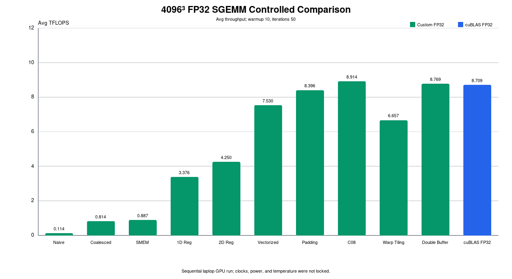

# CUDA SGEMM Optimization Learning

A learning-oriented CUDA FP32 SGEMM optimization and performance-engineering
project — not a replacement for cuBLAS.

这是一个从朴素 FP32 SGEMM 出发，逐阶段学习 CUDA GEMM 优化的项目。仓库保留
每个阶段的 kernel、benchmark、正确性检查、历史结果与 Nsight Compute 证据，重点
是让“改了什么、瓶颈如何迁移、优化是否真的有效”都可以复现和追溯。

## Overview

- GPU：NVIDIA GeForce RTX 4060 Laptop GPU（Ada，Compute Capability 8.9）
- 主问题：row-major `C[M,N] = A[M,K] × B[K,N]`
- 主精度：FP32 CUDA Core；cuBLAS 主基准使用 `CUBLAS_COMPUTE_32F`
- 正式计时：CUDA Event，只覆盖 kernel / cuBLAS GEMM
- 默认口径：4096³，warmup 10 次，测量 50 次，报告 Avg 与 Best

当前 Git 历史没有 Stage 9，因此仓库保留 Stage 10/11 的原编号，不虚构或重排
历史阶段。

## Optimization Roadmap

```text
Naive
  ↓ Global Memory Coalescing
Shared Memory Tiling
  ↓ 1D Register Tiling
2D Register Tiling
  ↓ Vectorized float4 Access
Shared-memory Padding
  ↓ Compile-time Autotuning
Autotuned C08
  ├─ Warp Tiling experiment
  └─ Software Double Buffering experiment
```

Warp Tiling 和 Double Buffering 是 Stage 8 之后的两个实验方向，不是保证单调加速
的线性阶段。

## Controlled 4096³ FP32 Comparison

下表来自 2026-08-30 的一次统一脚本顺序运行：同一台 GPU、同一精度、warmup 10、
iterations 50。所有实现先在 256³ 上通过 CPU reference；4096³ 性能循环关闭 CPU
reference，避免把校验时间计入 latency。

| Stage | Implementation | Avg (ms) | Avg TFLOPS | Best TFLOPS |
| ----: | -------------- | -------: | ----------: | -----------: |
| 1 | [Naive](./1.naive_kernel/README.md) | 1202.6100 | 0.114 | 0.115 |
| 2 | [Global Memory Coalescing](./2.Global_Memory_Coalescing_kernel/README.md) | 168.8200 | 0.814 | 0.818 |
| 3 | [Shared Memory Tiling](./3.SMEM_kernel/README.md) | 154.9630 | 0.887 | 0.894 |
| 4 | [1D Register Tiling](./4.1D_Blocktiling_kernel/README.md) | 40.7154 | 3.376 | 3.441 |
| 5 | [2D Register Tiling](./5.2D_Blocktiling_kernel/README.md) | 32.3371 | 4.250 | 4.322 |
| 6 | [Vectorized Access](./6.Vectorize_kernel/README.md) | 18.2516 | 7.530 | 8.022 |
| 7 | [Shared-memory Padding](./7.Shared_Memory_Layout_Optimization/README.md) | 16.3700 | 8.396 | 8.977 |
| 8 | [Autotuned C08](./8.Autoing_kernel/README.md) | 15.4178 | 8.914 | 9.406 |
| 10 | [Warp Tiling](./10.Wraptiling_kernel/README.md) | 20.6457 | 6.657 | 6.932 |
| 11 | [Double Buffering](./11.Double_Buffering/README.md) | 15.6738 | 8.769 | 9.224 |
| baseline | [cuBLAS FP32](./cuBLAS_baseline/README.md) | 15.7804 | 8.709 | 9.254 |

这次统一运行中，最佳自定义配置 C08 将 Avg throughput 从 Naive 的 0.114 TFLOPS
提高到 8.914 TFLOPS，约为 `78.0×`。它与本轮 cuBLAS FP32 的 8.709 TFLOPS
处于相近性能区间。C08 的 Avg 高约 2.35%，但这是未锁定温度、功耗和频率的单次
顺序运行，不足以宣称稳定超过 cuBLAS。



机器可读数据见
[`results/rtx4060_laptop/comparison_4096.csv`](./results/rtx4060_laptop/comparison_4096.csv)。

## Historical Results

历史完整 suite 记录中，Stage 8 C08 为 9.665 Avg TFLOPS，cuBLAS FP32 为
9.429 Avg TFLOPS；两者来自不同运行，不能当作严格同轮排名。历史逐尺寸结果、
独立复测和来源说明保存在 [PERFORMANCE_SUMMARY.md](./PERFORMANCE_SUMMARY.md) 与
[`results/final_4096.csv`](./results/final_4096.csv)，不会用单次最好数字覆盖。

## cuBLAS FP32 Comparison

cuBLAS wrapper 使用 row-major buffer，通过 column-major 等价关系计算
`Cᵀ = Bᵀ × Aᵀ`，并用 CPU reference 验证布局正确性。主基准使用
`CUDA_R_32F` 输入/输出与 `CUBLAS_COMPUTE_32F`；TF32 只作为独立 Tensor Core
实验，不进入上面的 FP32 主表。

## Profiling Findings

- Coalescing 将 warp 的 global-memory 访问整理为连续地址，解决了最早期最明显的
  memory-access 问题。
- Stage 6 的 Nsight 报告显示 shared load/store bank conflict；Stage 7 padding
  报告中对应 conflict 降为 0，并在大尺寸 workload 上提高吞吐。
- Warp Tiling 没有改善最佳 kernel：报告显示 168 registers/thread、25% 理论
  occupancy 和 shared-store conflict，4096³ 回退到 6.657 TFLOPS。
- 软件 Double Buffering 通过寄存器预取与 ping-pong shared memory 恢复部分性能，
  但仍受 register-limited occupancy、依赖、同步和 shared-load conflict 限制。

详细截图、原始 `.ncu-rep` 和采集方法见各 Stage 的 `profiling/` 与
[Nsight Compute Profiling Guide](./docs/NSIGHT_COMPUTE_PROFILING_GUIDE.md)。

## Build and Reproduce

```bash
# 默认编译到 build/，目标架构 sm_89
make all

# 所有阶段的 256³ correctness
./scripts/smoke_test.sh

# 一条命令重跑统一 4096³ FP32 比较
./scripts/run_comparison.sh

# 从统一 CSV 重建 SVG/PNG 主图（PNG 转换需要 ImageMagick convert）
python3 scripts/plot_results.py
```

可通过环境变量调整迭代次数，例如：

```bash
WARMUP=5 ITERS=20 ./scripts/run_comparison.sh
CUDA_ARCH=sm_86 make all
```

单阶段 benchmark 与 profiler 入口：

```bash
./scripts/benchmark_stage.sh double-buffering 4096 4096 4096
./scripts/profile_stage.sh double-buffering full
./scripts/profile_stage.sh double-buffering instr
```

## Project Structure

```text
GEMM_For_Myself/
├── 1.naive_kernel/ ... 8.Autoing_kernel/
├── 10.Wraptiling_kernel/
├── 11.Double_Buffering/
├── cuBLAS_baseline/
├── docs/                  # methodology, profiling, structure, assets
├── results/               # historical and controlled comparison CSV
├── scripts/               # build, correctness, benchmark, plot, profile
├── Makefile
├── PERFORMANCE_SUMMARY.md
└── TODO.md
```

权威 kernel / benchmark 关系和历史文件迁移见
[Project Structure](./docs/PROJECT_STRUCTURE.md) 与
[Reorganization Report](./docs/REORGANIZATION_REPORT.md)。

## Limitations

- Vectorized 之后的高性能 kernel 没有通用 tail path，要求尺寸满足各自 tile 与
  `float4` 对齐约束。
- 所有数据来自单台 Laptop GPU；温度、TGP 和 boost clock 未锁定。
- 当前只覆盖单 GPU FP32 SGEMM，没有 batched GEMM、混合精度或生产级调度接口。
- Stage 11 是 software prefetch + ping-pong shared memory，不是 `cp.async`。
- Tensor Core、`cp.async`、通用边界处理和更严格的多轮统计仍属于后续工作。

## References

本仓库是个人学习实现，优化概念和 API 以 NVIDIA 官方资料为技术参考，不声称这些
GEMM 优化思想是原创算法：

- [CUDA C++ Programming Guide](https://docs.nvidia.com/cuda/cuda-c-programming-guide/)
- [CUDA C++ Best Practices Guide](https://docs.nvidia.com/cuda/cuda-c-best-practices-guide/)
- [cuBLAS Documentation](https://docs.nvidia.com/cuda/cublas/)
- [Nsight Compute Documentation](https://docs.nvidia.com/nsight-compute/)

学习路线和后续实验见 [TODO.md](./TODO.md)。
